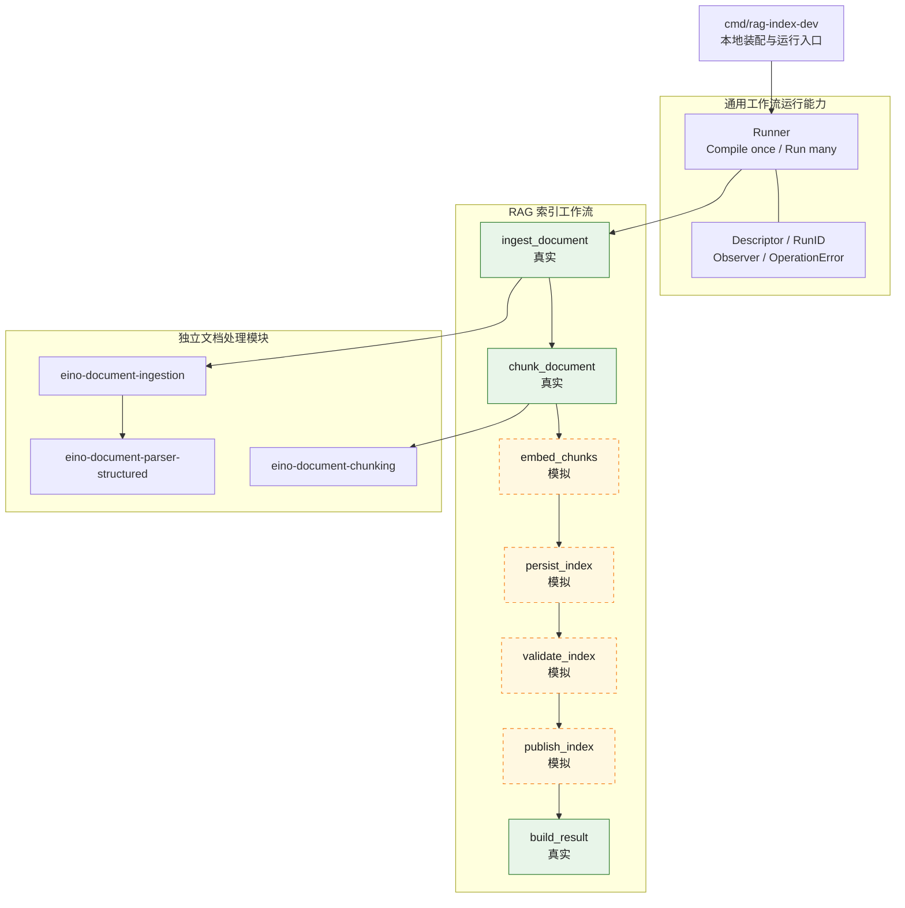

# eino-flow

基于 Eino 的通用 AI Workflow 编排层。仓库当前完成了第一个可运行闭环：文档索引工作流。

当前实现迁移自 `eino-lab` 的 demo19，源快照为 `31aba6b`。迁移过程中保留了已经验证的文档摄取、结构化解析、自动切分和模拟下游，同时抽取了仓库内部可复用的工作流运行层。

## 当前能力

| 阶段 | 状态 | 说明 |
|------|------|------|
| 文档摄取 | 真实 | 加载本地文件或受安全策略约束的 HTTP/HTTPS URL |
| 文档解析 | 真实 | Markdown 使用独立结构化 Parser，其他格式使用 ingestion 默认 Parser |
| 文档切分 | 真实 | 根据 Parser 输出能力选择 Structure-aware 或 Parent-child 策略 |
| Embedding | 模拟 | 不调用模型 |
| 索引持久化 | 模拟 | 不连接数据库 |
| 索引校验 | 模拟 | 不伪造校验成功 |
| 索引发布 | 模拟 | 不切换线上索引版本 |
| 结果构建 | 真实 | 返回 Parser、Chunk、关系、统计和各阶段状态 |

稳定工作流标识为 `rag_document_indexing@v4`，成功状态为 `chunked_with_simulated_downstream`。

PostgreSQL/GORM 连接基础设施与 RAG 索引表的只读 schema 校验已经就绪，但尚未接入上述工作流；当前运行入口仍不会连接数据库或执行索引写入。

## 当前架构



`internal/workflow` 只管理工作流运行，不依赖 RAG 业务类型：

- `Descriptor`：稳定的工作流名称和定义版本。
- `RunID`：由调用入口提供的一次执行标识。
- `Runner`：启动时编译一次，并发复用已编译拓扑。
- `Observer`：把日志、Trace 或指标适配为 Eino Callback。
- `OperationError`：补充工作流、版本、RunID 和生命周期阶段，同时保留原始错误链。
- `RunOption`：只暴露受控的 Observer 和最大步数等运行能力。

## 目录结构

```text
.
├── cmd/rag-index-dev/          本地运行与 Eino Dev 入口
├── governance/                仓库治理规范
├── internal/config/           全局运行配置、校验与脱敏
├── internal/postgres/         PostgreSQL 通用连接与生命周期
├── internal/workflow/         通用工作流运行能力
├── internal/rag/indexing/     RAG 文档索引 Feature
├── internal/rag/indexstore/   RAG 索引存储边界
│   └── postgres/              表映射与只读 schema 校验
├── testdata/knowledge.md      默认测试语料
├── docs/plans/                后续演进路线
├── AGENTS.md                  仓库治理规则路由
├── go.mod
└── go.sum
```

代码按 Feature 组织：`internal/rag/indexing` 独立拥有自己的 Request、Result、Dependencies、状态和拓扑；`internal/rag/indexstore/postgres` 持有索引构建和未来检索共同依赖的 PostgreSQL 表映射与存储实现。跨业务域的稳定技术能力放在 `internal/<capability>`，RAG 域内的稳定共享能力放在 `internal/rag/<capability>`。`internal/workflow` 不知道文档、Chunk 或索引阶段，`internal/config` 只负责运行配置边界，业务包不直接读取配置源。

详细的目录归属、依赖方向和 Go 编码约定见 [Go 工程规范](governance/go-engineering.md)。

## 运行

仓库使用 Go `1.26.x`、Eino `v0.9.12`。默认示例不需要模型、数据库或 API Key。

运行默认 Markdown：

```bash
go run ./cmd/rag-index-dev
```

解析指定文件或 URL：

```bash
go run ./cmd/rag-index-dev /absolute/path/to/document.txt
go run ./cmd/rag-index-dev https://example.com/document.md
```

输出包含完整 Chunk 正文，适合本地开发和测试，不应直接作为生产日志格式。

## Eino Dev

```bash
EINO_DEV=true go run ./cmd/rag-index-dev
```

在 Eino Dev 中连接 `127.0.0.1:52538`，选择 `rag_document_indexing@v4`。该模式只用于本地调试，不应暴露到公网。

## 验证

```bash
go test ./... -count=1
go test -race ./... -count=1
go vet ./...
```

测试覆盖 Markdown Structure-aware、TXT Parent-child、稳定 ID、语义路径、输入不可变性、错误链、超大原子块和公共 Runner 并发复用。

## 后续演进

真实索引下游的入库边界、表结构、写入校验和发布流程见 [RAG 索引入库设计 V1](docs/designs/rag-index-storage-v1.md)。其余后续方向维护在 [演进计划](docs/plans/2026-08-11-demo19-rag-migration.md)中。每个里程碑开始前先单独完成设计讨论和决策确认，再进入实现；当前不会提前实现真实索引下游或查询工作流。
