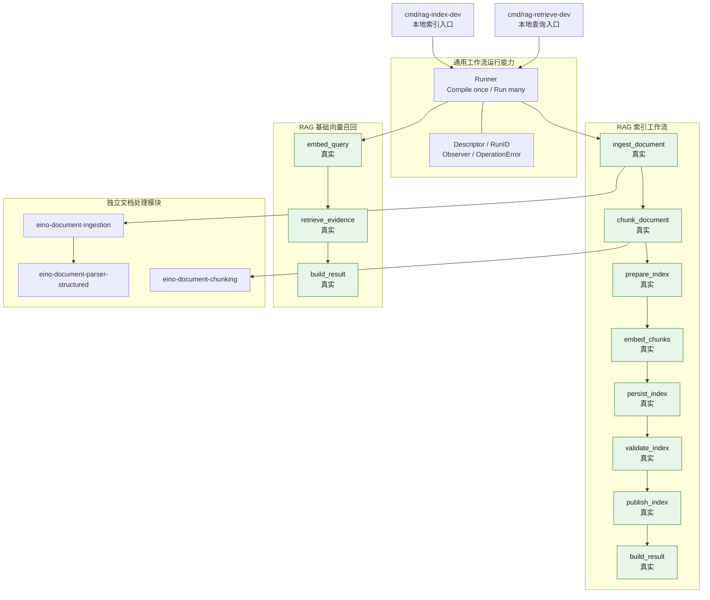
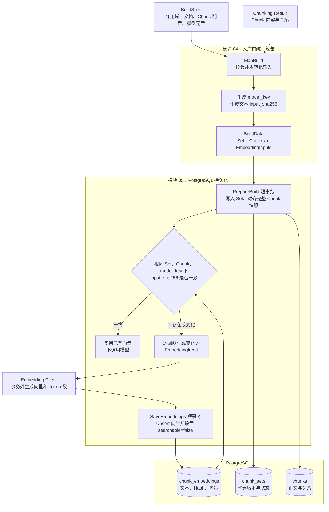
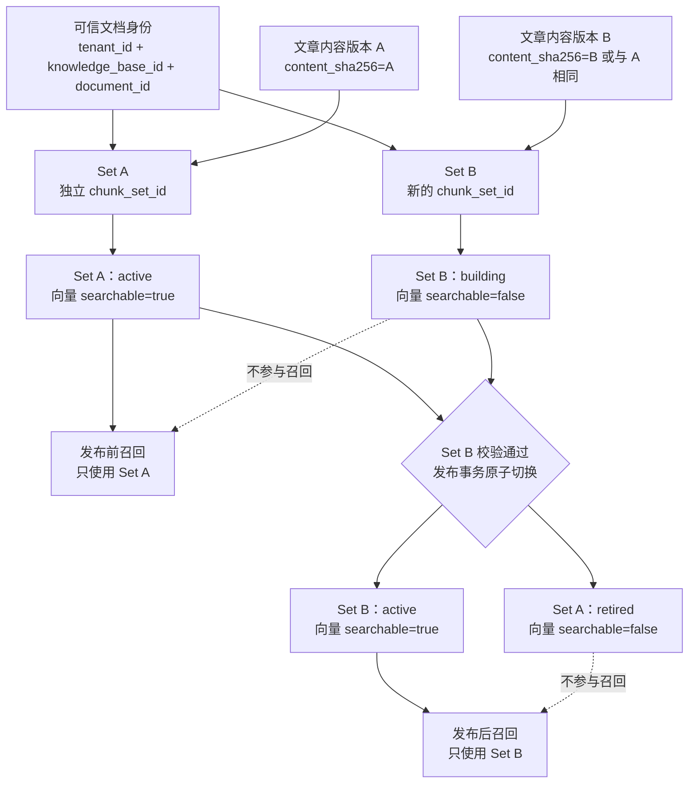

# eino-flow

基于 Eino 的通用 AI Workflow 编排层。仓库当前完成了文档索引与基础向量召回两个可运行闭环。

当前实现迁移自 `eino-lab` 的 demo19，源快照为 `31aba6b`。仓库已将文档摄取、结构化解析、自动切分、Embedding、持久化、校验和原子发布接成完整索引链路，并支持在可信租户与知识库作用域内执行 Query Embedding 和 pgvector TopK 证据召回。

## 当前能力

| 阶段 | 状态 | 说明 |
|------|------|------|
| 文档摄取 | 真实 | 加载本地文件或受安全策略约束的 HTTP/HTTPS URL |
| 文档解析 | 真实 | Markdown 使用独立结构化 Parser，其他格式使用 ingestion 默认 Parser |
| 文档切分 | 真实 | 根据 Parser 输出能力选择 Structure-aware 或 Parent-child 策略 |
| Embedding | 真实 | 调用 `text-embedding-v4`，保存 1536 维向量和精确 Token 用量 |
| 索引持久化 | 真实 | 写入 PostgreSQL building Set、Chunk 和不可检索向量 |
| 索引校验 | 真实 | 校验 Profile、Chunk 关系和 Embedding 完整性 |
| 索引发布 | 真实 | 按完整作用域串行化并原子切换 active Set |
| 结果构建 | 真实 | 返回 Parser、Chunk、关系、统计和各阶段状态 |
| Query Embedding | 真实 | 使用与索引一致的模型空间生成并校验 1536 维查询向量 |
| 向量召回 | 真实 | 在数据库 TopK 前过滤作用域、active、searchable 和 ModelKey |
| 证据结果 | 真实 | 返回稳定排序的原始 Chunk 和 cosine distance，无命中返回空集合 |

稳定工作流标识为 `rag_document_indexing@v5` 和 `rag_vector_retrieval@v1`，成功状态分别为 `published` 和 `completed`。

启动入口负责一次性加载配置、连接 PostgreSQL、校验既有 schema、构造 Index Store 和 Embedding 客户端，并在退出时关闭连接。索引工作流只依赖调用方接口和强类型构建配置，不读取环境变量。

Embedding 客户端固定请求 1536 维向量，并校验返回维度。阿里云兼容接口只返回请求级 Token 用量，因此当前按单条文本发起请求，以便为后续 `chunk_embeddings.embedding_token_count` 保存准确的服务端计量结果；`EMBEDDING_BATCH_SIZE` 在这一阶段控制最大并发数，合法范围为 1 到 10。

## 当前架构



## 索引存储核心逻辑

当前工作流执行以下索引构建与存储链路：



向量记录使用 `(chunk_set_id, chunk_id, model_key)` 标识一个 Chunk 在特定模型空间中的当前向量；`input_sha256` 是最终 Embedding 文本的 Hash，用于判断已有向量能否复用。模型或模型配置变化会生成新的 `model_key`，文本变化会生成新的 `input_sha256`，任一变化都需要重新生成向量。

`PrepareBuild` 和 `SaveEmbeddings` 分别使用短事务，Embedding 网络请求位于两个事务之间，避免模型调用长时间占用数据库锁。`Validate` 使用只读快照执行显式校验，`Publish` 在发布事务内再次校验并原子切换版本，避免校验与发布之间的竞态。

### 文档身份与索引版本生命周期

`document_id` 表示一篇文章的稳定业务身份，`content_sha256` 表示该文章当前的内容版本，`chunk_set_id` 表示一次独立的索引构建。相同文章重新构建时保留 `document_id`，并创建新的 Set UUID。



发布以完整 Set 为单位，不会只切换部分 Chunk。Retriever 必须在数据库查询阶段同时约束可信作用域、`chunk_sets.status='active'`、`chunk_embeddings.searchable=true` 和目标 `model_key`，避免 building 或 retired 版本进入向量候选集。工作流使用同一个 Set ID 支持幂等重试：Hash 未变化的已有向量会被复用，不会重复调用模型。

`internal/workflow` 只管理工作流运行，不依赖 RAG 业务类型：

- `Descriptor`：稳定的工作流名称和定义版本。
- `RunID`：由调用入口提供的一次执行标识。
- `Runner`：启动时编译一次，并发复用已编译拓扑。
- `Observer`：把日志、Trace 或指标适配为 Eino Callback。
- `OperationError`：补充工作流、版本、RunID 和生命周期阶段，同时保留原始错误链。
- `RunOption`：只暴露受控的 Observer 和最大步数等运行能力。

## 目录结构

```text
.
├── cmd/rag-index-dev/          本地运行与 Eino Dev 入口
├── cmd/rag-retrieve-dev/       本地基础向量召回入口
├── governance/                仓库治理规范
├── internal/config/           全局运行配置、校验与脱敏
├── internal/embedding/        text-embedding-v4 客户端与精确 Token 计量
├── internal/postgres/         PostgreSQL 通用连接与生命周期
├── internal/workflow/         通用工作流运行能力
├── internal/rag/indexing/     RAG 文档索引 Feature
├── internal/rag/retrieval/    RAG 基础向量召回 Feature
├── internal/rag/indexstore/   RAG 索引存储边界
│   └── postgres/              表映射、schema 校验与构建持久化
├── testdata/knowledge.md      默认测试语料
├── docs/plans/                后续演进路线
├── AGENTS.md                  仓库治理规则路由
├── go.mod
└── go.sum
```

代码按 Feature 组织：`internal/rag/indexing` 独立拥有自己的 Request、Result、Dependencies、状态和拓扑；`internal/rag/indexstore/postgres` 持有索引构建和未来检索共同依赖的 PostgreSQL 表映射与存储实现。跨业务域的稳定技术能力放在 `internal/<capability>`，RAG 域内的稳定共享能力放在 `internal/rag/<capability>`。`internal/workflow` 不知道文档、Chunk 或索引阶段，`internal/config` 只负责运行配置边界，业务包不直接读取配置源。

详细的目录归属、依赖方向和 Go 编码约定见 [Go 工程规范](governance/go-engineering.md)。

## 运行

仓库使用 Go `1.26.x`、Eino `v0.9.12`。运行入口会执行真实模型调用和数据库发布，启动前必须按 [RAG 索引入库设计 V1](docs/designs/rag-index-storage-v1.md) 创建 schema，并配置以下必填环境变量：

```bash
export POSTGRES_HOST='127.0.0.1'
export POSTGRES_USER='application'
export POSTGRES_PASSWORD='<数据库密码>'
export POSTGRES_DB='knowledge'
export POSTGRES_SSLMODE='disable'
export EMBEDDING_BASE_URL='https://dashscope.aliyuncs.com/compatible-mode/v1'
export EMBEDDING_KEY='<Embedding API Key>'
export EMBEDDING_MODEL='text-embedding-v4'
```

端口、schema、连接池、Embedding 维度、超时和并发数有安全默认值，完整变量名见 `internal/config/load.go`。

索引默认 Markdown：

```bash
go run ./cmd/rag-index-dev
```

索引指定文件或 URL；第二个可选参数是用于重试的既有 Set UUID：

```bash
go run ./cmd/rag-index-dev /absolute/path/to/document.txt
go run ./cmd/rag-index-dev https://example.com/document.md
go run ./cmd/rag-index-dev /absolute/path/to/document.txt 11111111-1111-4111-8111-111111111111
```

输出包含完整 Chunk 正文，适合本地开发和测试，不应直接作为生产日志格式。

查询默认问题，或显式传入问题与 TopK：

```bash
go run ./cmd/rag-retrieve-dev
go run ./cmd/rag-retrieve-dev "Markdown 文档使用什么切分策略？" 3
```

查询入口固定使用本地开发作用域 `local-development/default`，输出 ModelKey、查询 Token 用量和证据块，不输出查询向量。该入口用于开发验收，不是服务化接口。

## Eino Dev

```bash
EINO_DEV=true go run ./cmd/rag-index-dev
EINO_DEV=true go run ./cmd/rag-retrieve-dev
```

在 Eino Dev 中连接 `127.0.0.1:52538`，选择对应的 `rag_document_indexing@v5` 或 `rag_vector_retrieval@v1`。两个入口使用同一开发端口，不应同时启动；该模式只用于本地调试，不应暴露到公网。

## 验证

```bash
go test ./... -count=1
go test -race ./... -count=1
go vet ./...
```

默认测试使用内存替身，不访问真实数据库或模型服务。测试覆盖 Markdown Structure-aware、TXT Parent-child、真实节点调用顺序、稳定 ID、同 Set 重试复用、输入不可变性、错误链、超大原子块、向量召回边界和公共 Runner 并发复用。

真实端到端验收需要显式注入 PostgreSQL 与 Embedding 配置，并单独开启外部测试。以下命令会使用 UUID 隔离租户，结束后按租户清理 Set、Chunk 和 Embedding；输出不包含密码、API Key、正文或向量：

```bash
set -a
source .env
set +a
EINO_FLOW_WORKFLOW_E2E=1 EINO_FLOW_POSTGRES_INTEGRATION=1 \
  go test ./internal/rag/indexstore/postgres -count=1 \
  -run 'TestValidateConfiguredDatabase|TestStoreConfiguredDatabaseLifecycle|TestStoreConfiguredDatabaseConcurrentPublish|TestStoreConfiguredDatabaseRetrievalIsolation|TestWorkflowConfiguredEndToEnd|TestRetrievalConfiguredEndToEnd' -v
```

该验收覆盖真实 Markdown Structure-aware 与 TXT Parent-child 构建、发布前中断后的同 Set 重试与向量复用、内容变更后的新旧 Set 原子切换、Embedding 失败不影响已有 active Set，以及发布后基础向量召回与不存在知识库的空结果。不开启 `EINO_FLOW_WORKFLOW_E2E=1` 时，普通测试不会访问真实外部依赖。

## 后续演进

真实索引下游的入库边界、表结构、写入校验和发布流程见 [RAG 索引入库设计 V1](docs/designs/rag-index-storage-v1.md)。其余后续方向维护在 [演进计划](docs/plans/2026-08-11-demo19-rag-migration.md)中。当前查询能力只返回基础向量证据，不包含答案生成、引用渲染、上下文扩展、混合检索、Rerank、Agent 或服务化入口。
