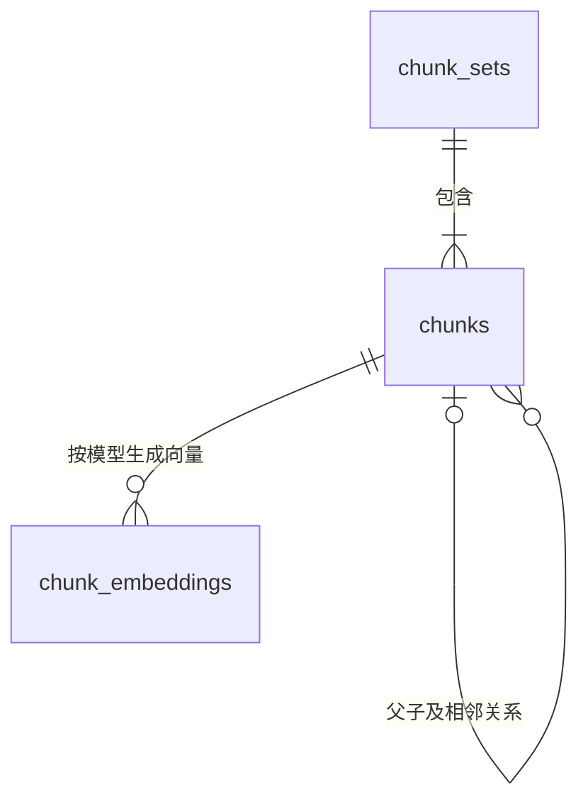

# RAG 索引入库设计 V1

## 1. 目标与边界

V1 负责把 Chunking 结果转换为可发布、可检索的一组 Chunk 和向量，使用 PostgreSQL 与 pgvector 保存数据。同时建立租户、知识库、文档三级检索作用域，为后续 Metadata 过滤、文档权限和混合检索保留稳定边界。

本设计只定义 Chunking 和检索直接依赖的数据：

- `chunk_sets`：一个文档在一种 Chunk 策略和 Profile 下的一次构建结果。
- `chunks`：Parent、Child、Structure 等通用 Chunk。
- `chunk_embeddings`：真正参与向量检索的 Chunk 及其 Embedding 输入。

原始文件内容、Parser 产物、完整逻辑文档版本和任务队列由下游文档系统负责，不放入这三张表。`chunk_sets` 只保存引用和审计所需的安全来源标识、展示名称与内容指纹，不保存原始文件本身。Chunking 核心包仍只负责生成 Chunk，不依赖数据库、Embedding 模型或 Retriever。

V1 明确包含以下扩展性基础，但不提前实现完整查询能力：

- `tenant_id + knowledge_base_id` 作为所有构建、发布和查询的可信作用域；单租户部署也必须传入稳定值，例如 `default`，不能留空。
- `chunks.metadata` 保存非安全性的内容属性，供后续语言、版本、标签和块类型过滤。
- `(chunk_set_id, chunk_id)` 作为所有召回通道的统一候选标识，后续关键词索引可与向量索引并列扩展。
- `chunk_sets.source_uri + source_name`、`source_unit_ids` 和结构 Metadata 共同保留引用追踪基础；用户可读引用仍需在查询工作流设计中确定与文档系统的解析契约。

V1 不包含用户、角色、用户组 ACL，也不包含关键词索引、Rerank 或答案生成。原因不是这些能力不重要，而是 ACL 依赖实际身份模型，中文关键词检索依赖分词与数据库扩展选型；在这些约束未确认前写死实现会形成错误兼容承诺。

## 2. Chunk 入库映射

| 策略 | `kind` | `level` | `parent_chunk_id` | 是否生成向量 |
|---|---|---:|---|---|
| Parent-child | `parent` | 0 | `NULL` | 否 |
| Parent-child | `child` | 1 | Parent Chunk ID | 是 |
| Structure-aware | `structure` | 0 | `NULL` | 是 |

Parent-child 使用 Child 做精确召回，命中后通过 `parent_chunk_id` 回表获得 Parent 正文。Structure-aware 的输出本身就是检索单元，原文结构深度、章节身份、可读标题路径和块类型保存在 `metadata`。

`Result.Relations` 不单独建表：父子和相邻关系已经由外键列保存，来源关系可以由 `source_unit_ids` 还原。出现多父节点、跨文档引用等真实需求后，再增加通用关系表。

## 3. 表结构

以下 DDL 假设 PostgreSQL 13+、pgvector 支持 HNSW，并固定使用一个 1536 维 Embedding 模型。上线前必须按实际模型调整维度和 `model_key`。

```sql
BEGIN;

CREATE EXTENSION IF NOT EXISTS pgcrypto;
CREATE EXTENSION IF NOT EXISTS vector;

CREATE TABLE chunk_sets (
    id              uuid PRIMARY KEY DEFAULT gen_random_uuid(),
    tenant_id       text NOT NULL CHECK (btrim(tenant_id) <> ''),
    knowledge_base_id text NOT NULL CHECK (btrim(knowledge_base_id) <> ''),
    document_id     text NOT NULL CHECK (btrim(document_id) <> ''),
    source_uri      text NOT NULL CHECK (btrim(source_uri) <> ''),
    source_name     text NOT NULL CHECK (btrim(source_name) <> ''),
    content_sha256  text NOT NULL
                    CHECK (content_sha256 ~ '^[0-9a-f]{64}$'),
    strategy_name   text NOT NULL CHECK (btrim(strategy_name) <> ''),
    profile_name    text NOT NULL CHECK (btrim(profile_name) <> ''),
    profile_version text NOT NULL CHECK (btrim(profile_version) <> ''),
    config          jsonb NOT NULL DEFAULT '{}'::jsonb
                    CHECK (jsonb_typeof(config) = 'object'),
    status          text NOT NULL DEFAULT 'building'
                    CHECK (status IN ('building', 'active', 'retired', 'failed')),
    created_at      timestamptz NOT NULL DEFAULT now(),
    activated_at    timestamptz,
    CHECK (status <> 'active' OR activated_at IS NOT NULL)
);

CREATE UNIQUE INDEX uq_chunk_sets_active
    ON chunk_sets (tenant_id, knowledge_base_id, document_id, strategy_name)
    WHERE status = 'active';

CREATE INDEX idx_chunk_sets_lookup
    ON chunk_sets (
        tenant_id,
        knowledge_base_id,
        document_id,
        strategy_name,
        status
    );

CREATE TABLE chunks (
    chunk_set_id      uuid NOT NULL REFERENCES chunk_sets (id) ON DELETE CASCADE,
    chunk_id          text NOT NULL CHECK (btrim(chunk_id) <> ''),
    kind              text NOT NULL CHECK (btrim(kind) <> ''),
    level             integer NOT NULL CHECK (level >= 0),
    parent_chunk_id   text,
    previous_chunk_id text,
    next_chunk_id     text,
    sequence          integer NOT NULL CHECK (sequence > 0),
    content           text NOT NULL CHECK (btrim(content) <> ''),
    character_count   integer NOT NULL CHECK (character_count > 0),
    token_count       integer NOT NULL DEFAULT 0 CHECK (token_count >= 0),
    source_unit_ids   text[] NOT NULL CHECK (cardinality(source_unit_ids) > 0),
    metadata          jsonb NOT NULL DEFAULT '{}'::jsonb
                      CHECK (jsonb_typeof(metadata) = 'object'),
    created_at        timestamptz NOT NULL DEFAULT now(),
    PRIMARY KEY (chunk_set_id, chunk_id),
    UNIQUE (chunk_set_id, sequence),
    CHECK (parent_chunk_id IS NULL OR parent_chunk_id <> chunk_id),
    CHECK (previous_chunk_id IS NULL OR previous_chunk_id <> chunk_id),
    CHECK (next_chunk_id IS NULL OR next_chunk_id <> chunk_id),
    FOREIGN KEY (chunk_set_id, parent_chunk_id)
        REFERENCES chunks (chunk_set_id, chunk_id)
        DEFERRABLE INITIALLY DEFERRED,
    FOREIGN KEY (chunk_set_id, previous_chunk_id)
        REFERENCES chunks (chunk_set_id, chunk_id)
        DEFERRABLE INITIALLY DEFERRED,
    FOREIGN KEY (chunk_set_id, next_chunk_id)
        REFERENCES chunks (chunk_set_id, chunk_id)
        DEFERRABLE INITIALLY DEFERRED
);

CREATE INDEX idx_chunks_parent
    ON chunks (chunk_set_id, parent_chunk_id)
    WHERE parent_chunk_id IS NOT NULL;

CREATE INDEX idx_chunks_kind_sequence
    ON chunks (chunk_set_id, kind, sequence);

CREATE INDEX idx_chunks_metadata
    ON chunks USING gin (metadata);

CREATE TABLE chunk_embeddings (
    chunk_set_id        uuid NOT NULL,
    chunk_id            text NOT NULL,
    model_key           text NOT NULL CHECK (btrim(model_key) <> ''),
    embedding_text      text NOT NULL CHECK (btrim(embedding_text) <> ''),
    embedding_token_count integer NOT NULL CHECK (embedding_token_count > 0),
    input_sha256        text NOT NULL
                        CHECK (input_sha256 ~ '^[0-9a-f]{64}$'),
    embedding           vector(1536) NOT NULL,
    searchable          boolean NOT NULL DEFAULT false,
    created_at          timestamptz NOT NULL DEFAULT now(),
    updated_at          timestamptz NOT NULL DEFAULT now(),
    PRIMARY KEY (chunk_set_id, chunk_id, model_key),
    FOREIGN KEY (chunk_set_id, chunk_id)
        REFERENCES chunks (chunk_set_id, chunk_id)
        ON DELETE CASCADE
);

CREATE INDEX idx_chunk_embeddings_model
    ON chunk_embeddings (model_key);

CREATE INDEX idx_chunk_embeddings_hnsw_cosine
    ON chunk_embeddings
    USING hnsw (embedding vector_cosine_ops)
    WITH (m = 16, ef_construction = 128)
    WHERE searchable;

COMMIT;
```

### 3.1 三张表的整体关系

三张表不是三个彼此独立的存储集合，而是共同描述一个可发布的索引版本：



- `chunk_sets` 是版本和发布边界，回答“当前应该检索哪一批 Chunk”。
- `chunks` 是内容和结构边界，回答“召回结果对应什么正文，以及它和其他 Chunk 有什么关系”。
- `chunk_embeddings` 是模型索引边界，回答“哪些 Chunk 能参与某个 Embedding 模型空间下的向量检索”。

一次索引构建先创建一个 `chunk_sets` 记录，再向该 Set 写入全部 `chunks` 和需要检索的 `chunk_embeddings`。只有三部分通过完整性校验后，整个 Set 才能从 `building` 原子切换为 `active`。因此，Retriever 不应直接把向量表当作无版本的向量集合使用。

### 3.2 `chunk_sets`：索引版本与发布状态

一条 `chunk_sets` 记录表示：某个文档使用一种 Chunk 策略和一份确定配置生成的一次完整索引构建结果。它是后续写入、校验、发布、回滚和清理的最小管理单位。

| 字段 | 作用 | 设计原因 |
|---|---|---|
| `id` | 一次构建的稳定标识 | 同一文档可以反复重建；不能用业务作用域和 `document_id` 直接作为主键，否则新版本会覆盖旧版本，也无法做到无空窗发布。重试必须复用该 ID。 |
| `tenant_id` | 租户隔离标识 | 属于安全边界和所有查询必带条件，不能放入可选 JSONB。单租户部署使用固定值，避免以后增加租户时修改主索引和调用契约。 |
| `knowledge_base_id` | 租户内知识库或语料集合标识 | 用于路由检索范围、知识库级授权和容量治理；同一个 `document_id` 可以安全存在于不同知识库。 |
| `document_id` | 关联外部文档系统中的逻辑文档 | 本设计不拥有原始文档，因此只保存作用域内稳定的业务标识，不建立到外部系统的数据库外键。 |
| `source_uri` | 保存稳定且安全的逻辑来源标识 | 用于引用解析、重新摄取和问题定位；不得保存宿主机绝对路径、认证信息、临时签名参数或其他秘密。实际抓取地址只在运行时使用。 |
| `source_name` | 保存用户可读的来源名称 | 引用展示不应依赖解析 URI，也不能假设 URI 的最后一段始终是有效文件名。它是展示名称，不作为文档身份或唯一键。 |
| `content_sha256` | 标识本次构建使用的原文内容 | 同一逻辑文档可以产生多个内容版本；内容指纹用于审计、幂等判断和确认引用对应的原文版本。 |
| `strategy_name` | 标识 `parent_child`、`structure_aware` 等切分策略 | 同一文档可以同时维护不同检索策略；发布锁和唯一活动版本都按“租户 + 知识库 + 文档 + 策略”隔离。 |
| `profile_name` | 标识一套具名配置 | 便于区分默认配置、长文配置等可读用途，而不是只保存难以识别的 JSON。 |
| `profile_version` | 标识配置语义版本 | 配置或 Embedding 输入规则变化后必须产生新版本，避免同名 Profile 在不同时间产生不可复现的结果。 |
| `config` | 保存本次实际生效的规范化配置快照 | 构建结果必须可解释、可复现；不能只依赖应用当前默认值，因为默认值以后可能变化。 |
| `status` | 控制构建生命周期 | 未完成的数据不能被检索；旧版本必须在新版本发布成功前继续服务。 |
| `created_at` | 记录构建创建时间 | 用于审计、失败构建清理和版本保留策略。 |
| `activated_at` | 记录正式发布时间 | 区分“构建完成时间”和“对外生效时间”，同时约束 `active` 记录必须确实完成发布。 |

状态含义如下：

```text
                    可重试错误
                        │
                        ▼
创建 ──> building ──校验通过并发布──> active ──被新版本替换──> retired
             │
             └──不可恢复或重试耗尽──> failed
```

- `building`：允许分批写入和幂等重试，但不可检索。
- `active`：已经发布，允许 Retriever 使用。
- `retired`：曾经发布但已被新版本替代，可暂时保留用于审计或回滚分析。
- `failed`：确认无法完成的构建，不参与检索，后续可按保留策略清理。

`uq_chunk_sets_active` 使用部分唯一索引，保证同一个 `tenant_id + knowledge_base_id + document_id + strategy_name` 最多只有一个活动版本。它是数据库层的最终一致性保护；正常发布仍需 advisory lock，因为发布过程还要同步修改新旧 Set 的向量可检索状态。

这里有一个明确语义：同一作用域内的同一文档、同一策略在任意时刻只有一个活动 Profile。如果未来需要让多个 Profile 同时在线并由调用方选择，唯一键和发布锁范围都必须再加入 `profile_name`，不能只改查询条件。

`source_uri` 不是任意抓取地址。HTTP URL 入库前必须移除 UserInfo、签名参数和其他敏感查询参数；本地文件必须转换为文档系统可解析的逻辑 URI，不能把 `/Users/...`、`/data/private/...` 等部署绝对路径持久化。发生重定向后的 `resolved_uri` 可能短期有效或包含签名，因此不进入数据库。无法生成安全稳定来源标识时，入库请求必须失败，不能退化为保存原始抓取地址。

### 3.3 `chunks`：正文、顺序和结构关系

一条 `chunks` 记录表示某次 Set 构建中的一个可寻址内容单元。它既保存真正提供给问答上下文的正文，也保存 Parent-child 和 Structure-aware 检索所需的结构关系。

| 字段 | 作用 | 设计原因 |
|---|---|---|
| `chunk_set_id` | 指明 Chunk 属于哪个构建版本 | 所有关系、召回和发布都必须限制在同一个 Set 内，避免新旧版本内容串联。 |
| `chunk_id` | Chunk 在构建结果中的确定性标识 | 相同内容在重试时保持稳定，便于 Upsert；与 `chunk_set_id` 组成主键后，同一个确定性 ID 可以安全地存在于不同版本中。 |
| `kind` | 区分 `parent`、`child`、`structure` 等语义类型 | Retriever 根据类型选择召回和回表逻辑；使用字符串便于新增策略，不把业务扩展绑定到数据库枚举迁移。 |
| `level` | 表示当前策略下的层级 | V1 用于校验 Parent 为 0、Child 为 1、Structure 为 0；它是结构约束，不等同于 Markdown 标题级别。 |
| `parent_chunk_id` | Child 指向同 Set 内的 Parent | Child 负责精确召回，Parent 负责提供较完整上下文。数据库外键阻止悬空 Parent。 |
| `previous_chunk_id` / `next_chunk_id` | 保存同 Set 内的前后相邻关系 | 支持命中后按需扩展上下文；双向一致性由写入层校验，外键只负责保证目标存在。 |
| `sequence` | 保存 Chunk 在该 Set 中的稳定顺序 | 用于确定性输出、邻接校验和按原文顺序组织上下文；同一 Set 内唯一，避免排序歧义。 |
| `content` | 保存可返回给上层的 Chunk 正文 | 检索命中后不依赖 Parser 临时产物或再次解析原始文件，保证线上查询路径稳定。 |
| `character_count` | 保存字符数量 | 用于快速统计和基础约束，不必每次扫描正文重新计算。 |
| `token_count` | 保存 Chunk 本身的 Token 数 | 用于后续上下文预算；它和 Embedding 输入 Token 数不是同一个概念，因此不能与 `embedding_token_count` 合并。 |
| `source_unit_ids` | 记录 Chunk 来源的 Parser 单元 | 用于来源追踪和问题定位；一个 Chunk 可能合并多个源单元，所以使用数组。 |
| `metadata` | 保存策略专用、尚未稳定的结构字段 | 例如语义路径、标题路径和块类型。先使用 JSONB 保持演进能力，高频查询字段稳定后再提升为普通列。 |
| `created_at` | 记录入库时间 | 用于审计和排查部分构建。 |

主键选择 `(chunk_set_id, chunk_id)` 而不是全局唯一 `chunk_id`，原因是 Chunk ID 通常由内容和结构确定：文档重建后，未变化的 Chunk 可能拥有相同 ID。允许它同时存在于旧 Set 和新 Set 中，才能在新版本构建期间继续使用旧版本提供查询。

Parent、Previous、Next 外键都带上 `chunk_set_id`，因此数据库能够禁止跨版本关系。外键使用 `DEFERRABLE INITIALLY DEFERRED`，是因为一批 Chunk 可能先写入引用方、后写入被引用方；只要事务提交时所有目标都存在，写入顺序就不需要人为重排。

`Result.Relations` 没有单独建通用关系表，因为 V1 只有单 Parent 和线性相邻关系，三个外键列能提供更直接的约束和查询。只有出现多父节点、跨文档引用或带属性的边时，通用关系表才真正有必要。

### 3.4 `chunk_embeddings`：Embedding 输入与向量索引

一条 `chunk_embeddings` 记录表示：某个 Chunk 使用一个明确的 `model_key` 和输入文本生成的一条向量。不是所有 Chunk 都必须有对应记录，例如 Parent-child 策略中的 Parent 只负责回表，不进入 V1 向量索引。

| 字段 | 作用 | 设计原因 |
|---|---|---|
| `chunk_set_id` / `chunk_id` | 关联被向量化的 Chunk | 复合外键保证向量不脱离正文独立存在；删除 Set 或 Chunk 时可级联清理向量。 |
| `model_key` | 唯一标识模型空间及其配置版本 | 模型名称本身不够，Key 必须同时对应维度、距离算法和影响输出的配置；不同模型空间的分数不能直接混用。 |
| `embedding_text` | 保存实际发送给 Embedding 模型的最终文本 | 它可能在 `content` 基础上增加文档标题或语义路径。保存最终输入才能解释和复现向量，不能只保存 Chunk 正文。 |
| `embedding_token_count` | 保存 Embedding 输入的 Token 数 | 用于模型限额、成本统计和输入校验；Embedding 模型 Tokenizer 可能不同于最终问答模型。 |
| `input_sha256` | 标识最终输入内容 | 重试时可判断向量是否仍然有效并跳过重复模型调用，避免逐字比较长文本。 |
| `embedding` | 保存固定维度的 pgvector 数据 | V1 固定一个 1536 维模型空间，使数据库能够建立类型明确的 HNSW 索引。 |
| `searchable` | 控制该向量是否进入线上 ANN 候选集 | 与 Set 状态一起组成双重发布条件，并让部分 HNSW 索引只包含已发布向量。 |
| `created_at` / `updated_at` | 记录首次生成和最后更新 | 用于审计重试、Hash 变化和向量刷新。 |

主键 `(chunk_set_id, chunk_id, model_key)` 表示同一 Set 中，一个 Chunk 对一个模型空间最多有一条当前向量。它允许未来保存多个同维度模型的向量，但 V1 仍只允许一个指定模型参与主索引；不同维度不能直接写入当前 `vector(1536)` 列。

`embedding_text` 与 `chunks.content` 看似重复，实际语义不同。例如 Structure-aware 在 `metadata_only` 模式下可能把标题路径拼到 Embedding 输入中以改善召回，但最终展示给模型或用户的仍应是原始 Chunk 正文。分开保存可以同时保证召回质量、结果可读性和生成过程可审计。

`searchable` 与 `chunk_sets.status` 也不是无意义重复。HNSW 会先从索引中选出近邻候选，再执行普通表条件过滤。如果 building 和 retired 向量也进入同一个 ANN 候选集，它们可能占用 TopK 名额，导致过滤后返回不足，并让索引随历史版本持续膨胀。部分索引 `WHERE searchable` 直接把未发布向量排除在 ANN 索引之外。

### 3.5 为什么拆成三张表

如果把 Set、Chunk 和向量合并为一张表，会产生以下问题：

- 每个 Chunk 都要重复保存文档、策略、Profile 和发布状态，状态切换需要更新大量重复字段。
- Parent 不生成向量，单表会出现大量只对部分 Kind 有意义的可空字段。
- 一个 Chunk 增加新模型向量时，要么复制整份正文，要么不断增加模型专用列。
- 无法用一条 Set 记录清晰表达“一批 Chunk 必须整体校验、整体发布”的事务边界。

反过来，如果只把 `chunk_embeddings` 当作独立向量库，正文和版本状态放在另一个数据库或服务，也会失去当前方案依赖的本地事务与外键：

- 向量写成功而 Chunk 写失败时会产生孤立数据。
- 发布时无法原子切换新旧 Set 的状态和向量可见性。
- Parent-child 命中后需要跨服务回表，增加延迟和部分失败处理。
- 完整性校验需要分布式协调或补偿逻辑。

因此，V1 在代码层可以把 PostgreSQL 实现封装为独立的 RAG Index Store，但三张表应由同一个存储模块和同一个 PostgreSQL 事务边界管理。未来即使服务化，也应该整体拆出 Index Store，而不是只拆向量表。

### 3.6 跨表关键设计理由

- `chunk_set_id + chunk_id` 作为 Chunk 主键，允许相同的确定性 Chunk ID 出现在不同构建版本中，关系外键始终限制在同一个 Set 内。
- `tenant_id` 和 `knowledge_base_id` 放在 `chunk_sets`，避免每个 Chunk 重复保存作用域；所有检索必须先联接有效 Set 并带上这两个条件，不能只查询向量表。
- `source_uri`、`source_name` 和 `content_sha256` 放在 `chunk_sets`，因为它们描述本次文档构建，不应在每个 Chunk 的 Metadata 中重复保存。
- `strategy_name` 和 `kind` 使用字符串而不是数据库枚举，新增策略时不需要修改表结构；策略与 Kind、Level、Parent 的组合合法性由写入校验负责。
- `metadata` 保存策略专用字段。只有某个字段形成稳定、高频的过滤或排序需求后，才提升为普通列或表达式索引。
- `input_sha256` 对最终 `embedding_text` 计算，用于跳过重复模型调用；`model_key` 必须唯一对应模型、维度、距离算法和配置版本。
- `searchable` 只存在于向量表，用于构建部分 HNSW 索引。只依赖跨表的 `chunk_sets.status` 过滤，会让 retired 或 building 向量先进入 ANN 候选，长期运行后影响召回数量和性能。
- 相邻和父子外键使用延迟校验，因此可以在一个事务中按 Chunking Result 原始顺序批量写入。

## 4. Embedding 输入

Embedding 输入必须确定性生成，不包含 Chunk ID、内部 Path ID、Sequence 或数据库主键。

Parent-child 只处理 `kind=child`：

```text
有可读文档标题：{document_title}\n\n{child_content}
没有可读标题：{child_content}
```

Structure-aware 处理全部 `kind=structure`：

```text
HeadingContext=prepend：直接使用 chunk.Content
HeadingContext=metadata_only：SemanticPath 非空时使用
  strings.Join(SemanticPath, " > ") + "\n\n" + chunk.Content
SemanticPath 为空：直接使用 chunk.Content
```

`embedding_token_count` 必须由当前 Embedding 模型的 Tokenizer 计算。最终问答模型的上下文预算可能使用不同 Tokenizer，不能直接假设两者相同。

`chunk_sets.config` 保存实际生效且足以复现 Chunk 和 Embedding 输入的配置，不得使用与运行参数不同的静态示例。当前应用实际使用 `HeadingContext=prepend`，配置快照也必须记录为 `prepend`。

当前默认配置应分别保存为：

```json
{
  "parent_max_runes": 2000,
  "child_max_runes": 500,
  "embedding_input_policy": "v1"
}
```

```json
{
  "max_runes": 1800,
  "min_runes": 600,
  "heading_context": "prepend",
  "embedding_input_policy": "v1"
}
```

每个 Set 只保存其策略实际使用的字段。配置变化时升级 `profile_version`，不能在同一 Profile 版本下静默改变配置。

## 5. 写入、校验与发布

### 5.1 构建写入

1. 调用方必须提供可信的 `tenant_id`、`knowledge_base_id`、`document_id`，以及经过安全规范化的 `source_uri`、`source_name` 和 `content_sha256`。入库层再按 `Chunk.DocumentID` 对 `chunking.Result` 分组，为每个作用域、文档和策略创建一个 `status=building` 的 Chunk Set。`chunk_set_id` 由任务首次创建并持久保存，重试必须复用该 ID。
2. 在事务中写入该组全部 Chunk。空字符串关系转换为 `NULL`；保留原始 `Sequence`，分组后即使有间隔也不重新编号。
3. 根据策略选择应向量化的 Chunk，生成 `embedding_text`、Token 数和 SHA-256，再写入 `chunk_embeddings`。构建阶段统一保持 `searchable=false`。
4. 同一个 `chunk_set_id + chunk_id + model_key` 使用 Upsert。Hash 未变化时跳过 Embedding 调用；Hash 变化时更新文本、Token 数、Hash、向量和 `updated_at`。
5. 可重试错误发生后，Set 保持 `building`，任务使用同一个 `chunk_set_id` 继续 Upsert；只有重试耗尽或确认不可恢复时才标记为 `failed`。两种状态下向量都保持不可检索，旧 active Set 不受影响。

Chunking Result 已经执行过结构和关系校验，入库层仍需再次校验策略约束，防止非标准写入方绕过核心包：

- `parent_child` 只能由 `parent/Level=0/Parent=NULL` 和 `child/Level=1/Parent!=NULL` 组成。
- `structure_aware` 只能写入 `structure/Level=0/Parent=NULL`。
- Parent、Previous、Next 必须存在于同一个 Chunk Set，且相邻关系应双向一致。
- Parent-child 的所有 Child、Structure-aware 的所有 Structure，都必须存在指定 `model_key` 的向量；Parent 不得进入 V1 主向量索引。
- `profile_name + profile_version` 必须对应同一份规范化配置。V1 由统一写入服务在事务锁内校验；出现多个独立写入方后再拆出 Profile 表。
- `tenant_id` 和 `knowledge_base_id` 只能来自经过认证的服务端上下文或可信任务载荷，不能从 Chunk Metadata 推导，也不能接受最终用户任意声明。
- `source_uri` 必须来自可信文档系统或经过安全规范化的任务载荷；入库层必须拒绝包含认证信息、敏感查询参数或部署绝对路径的值。

### 5.2 原子发布

发布必须使用一个短事务，并按 `tenant_id + knowledge_base_id + document_id + strategy_name` 串行化：

1. 对完整作用域键进行无歧义编码或稳定 Hash，并使用事务级 advisory lock 阻止同一作用域、文档和策略并发发布。不能直接拼接无分隔字符串，避免不同键组合发生碰撞。
2. 锁定目标 Set，确认其状态为 `building`，并完成 Chunk 与 Embedding 完整性校验。
3. 将旧 active Set 的 Embedding 更新为 `searchable=false`，再把旧 Set 更新为 `retired`。
4. 将新 Set 的 Embedding 更新为 `searchable=true`，再把新 Set 更新为 `active` 并设置 `activated_at=now()`。
5. 提交事务。Retriever 始终同时要求 `chunk_sets.status='active'` 和 `chunk_embeddings.searchable=true`。

事务提交前，读请求仍看到旧 Set；提交后只看到新 Set，不存在中间空窗。`uq_chunk_sets_active` 作为并发控制失效时的最后保护，而不是正常流程的锁机制。

## 6. 召回设计摘要

Retriever 的每次请求必须包含服务端解析出的 `tenant_id` 和至少一个允许访问的 `knowledge_base_id`。SQL 必须在执行向量距离排序时联接 `chunk_sets`，同时约束作用域、`chunk_sets.status='active'` 和 `chunk_embeddings.searchable=true`。作用域过滤不能放到应用层 TopK 之后执行。

该建模优先保证作用域唯一来源和事务一致性，但不能假设普通 B-tree 条件一定能与 HNSW 高效组合。实现查询时必须用真实数据检查 `EXPLAIN (ANALYZE, BUFFERS)`、过滤后 Recall@K 和 P95 延迟。若单个租户或知识库只占全局向量的很小比例，可在不改变业务主键的前提下采用 pgvector iterative scan、按租户或知识库分区，或在向量索引表冗余受数据库约束的作用域列；具体方案由数据规模和执行计划决定。

Parent-child 从 active Set 的 Child 向量中召回，按 `parent_chunk_id` 聚合并取最高 Child 分数，再回表读取 Parent 正文。父、子向量不在同一结果集直接混排。

Structure-aware 从 active Set 的 Structure 向量中召回。完成基础重排后，可沿 `previous_chunk_id/next_chunk_id` 扩展前后各一跳；扩展项必须属于相同 Chunk Set、文档和 `eino_chunking.structure.path`，并受最终问答模型的 Token 预算限制。

本章节只确定入库模型能够支持上述流程。TopK、分数融合、Rerank、上下文组装和评测标准在 RAG 查询工作流设计中单独确定。

## 7. Metadata 与权限扩展边界

### 7.1 非安全性 Metadata

`chunks.metadata` 用于保存语义路径、标题级别、块类型、语言、产品版本和业务标签等内容属性。查询工作流可以为稳定字段提供强类型 Filter，再编译为参数化 SQL；不允许客户端传入任意 SQL、JSONPath 或数据库列名。

满足以下任一条件的字段应从 JSONB 提升为普通列或独立关系表：

- 每次检索都必须过滤。
- 属于租户、权限或其他安全边界。
- 需要数据库外键、唯一约束或严格枚举约束。
- 已形成稳定、高频的过滤、分组或排序需求，并且 JSONB 执行计划无法满足目标。

### 7.2 ACL

用户、角色和用户组 ACL 不放进 `chunks.metadata`。推荐由身份系统负责认证和主体关系，Index Store 保存检索所需的知识库级或文档级 ACL 投影。权限必须在向量召回、关键词召回和 Rerank 之前生效，不能先召回全局 TopK 再由应用层删除无权结果。

V1 暂不定义 ACL 表，因为尚未确认实际主体模型和权限粒度。后续设计至少必须满足：

- 默认使用知识库级或文档级权限，不把相同 ACL 重复写入每个 Chunk。
- 如果文档内部存在不同权限，优先在摄取阶段按权限边界拆成不同逻辑文档；Parent 和相邻扩展不得跨越权限边界。
- 权限变化应通过 ACL 投影更新实时生效，不要求重新调用 Embedding 或重建 Chunk。
- 缓存键、Trace 和离线调试输出必须包含租户与授权范围，禁止缓存结果跨权限复用。
- PostgreSQL RLS 可以作为纵深保护，但不能替代 Retriever 的显式作用域和权限条件。

## 8. 后续实施规划

后续能力分阶段实施。阶段顺序代表依赖关系，不代表未经设计评审即可自动进入实现。

### 8.1 真实索引下游 V1

本阶段实现本文已经确定的数据模型：

- Embedding 输入构建、Token 统计和 Hash 去重。
- `chunk_sets`、`chunks`、`chunk_embeddings` 的事务写入、重试、校验和原子发布。
- `tenant_id + knowledge_base_id` 作用域贯穿入库、唯一索引和发布锁。
- 保留稳定文档 ID、安全来源标识、内容指纹、Chunk ID、来源单元、结构 Metadata 和模型 Profile，确保后续可评测、可引用、可审计。
- Index Store 接口使用索引构建、发布和统一候选语义，不把上层接口命名或约束为只能支持 pgvector。

本阶段不实现 ACL、关键词索引、查询生成、Rerank 或 Agent 循环。

### 8.2 基础查询 V1

在已发布索引上建立第一个可评测闭环：

- Query Embedding 和 pgvector 单路召回。
- 可信的租户、知识库、文档范围过滤，以及已确认字段的强类型 Metadata 过滤。
- 确定性 TopK、Parent 回表或相邻扩展、候选去重和 Token 预算。
- 无证据拒答、答案引用和引用来源解析。
- 建立离线查询集，对 Recall@K、MRR、答案正确性、引用正确性和 P95 延迟形成基线。

如产品在该阶段需要用户级权限，应先完成 ACL 模型设计和数据库内过滤，不允许使用应用层后过滤作为临时上线方案。

### 8.3 混合检索与重排

在基础评测能够定位向量召回缺口后增加：

- 新增与 `chunk_embeddings` 并列的关键词索引表，使用 `(chunk_set_id, chunk_id)` 作为统一候选标识；不修改现有 Chunk 主键。
- 根据中文语料、PostgreSQL 扩展权限和运维条件选择 `tsvector` 分词扩展、`pg_trgm` 或其他全文检索实现。
- 向量与关键词分别召回候选，优先使用 RRF 按排名融合，不直接混加不同量纲的原始分数。
- 在融合候选上增加可降级的 Rerank，并记录每个候选的召回通道、原始排名、原始分数和融合排名。
- 用相同测试集对比 Vector-only、Keyword-only 和 Hybrid，只有质量收益稳定且延迟、成本可接受时才默认启用。

关键词索引需要独立的 `analyzer_key`、最终索引文本、输入 Hash 和 `searchable`。发布事务届时同步切换向量与关键词索引的可见性，继续保持一个 Set 的原子发布。

### 8.4 自适应与 Agentic 增强

以下能力必须建立在稳定检索和评测基线之上，不提前进入存储 V1：

- Query rewriting 和多查询扩展。
- 动态 TopK、多路召回路由和更复杂的分数融合。
- 引用一致性复核和证据充分性判断。
- 受控 Agentic RAG：模型可以选择 Retriever、改写查询或有限重试，但必须设置工具白名单、最大轮次、超时、Token 与费用预算。

### 8.5 其他数据模型演进

- 新增固定长度、递归、语义、代码或表格策略时，优先增加新的 `strategy_name`、`kind` 和 Metadata，不修改核心表。
- 出现多父节点、引用或跨文档关系后，增加 `chunk_relations` 表。
- 出现多个独立配置写入方后，增加 `chunk_profiles` 表，数据库级保证 Profile 与配置一一对应。
- 多 Embedding 模型、多维度、稀疏向量或外部向量库出现真实需求后，再按模型维度拆分索引或向量表；V1 不在同一个 HNSW 中混用不同模型空间。
- 任务队列、Outbox、索引灰度、原始文件和 Parser Artifact 属于应用扩展，不反向耦合 Chunking 包。
